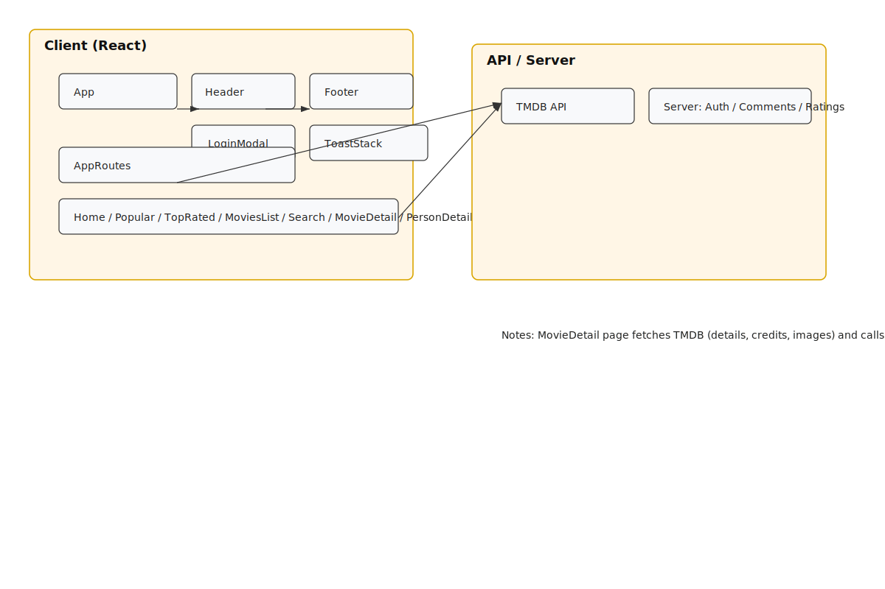
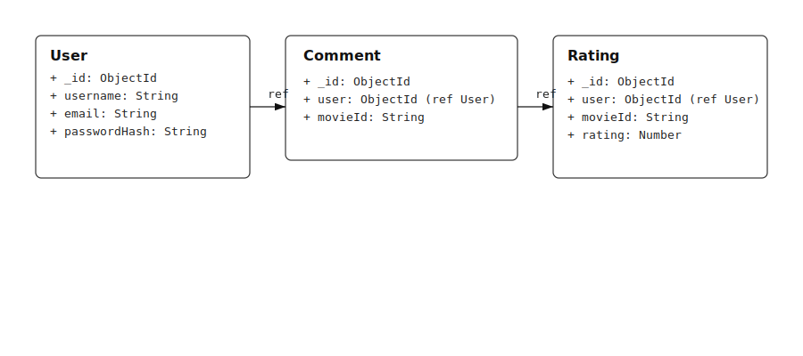
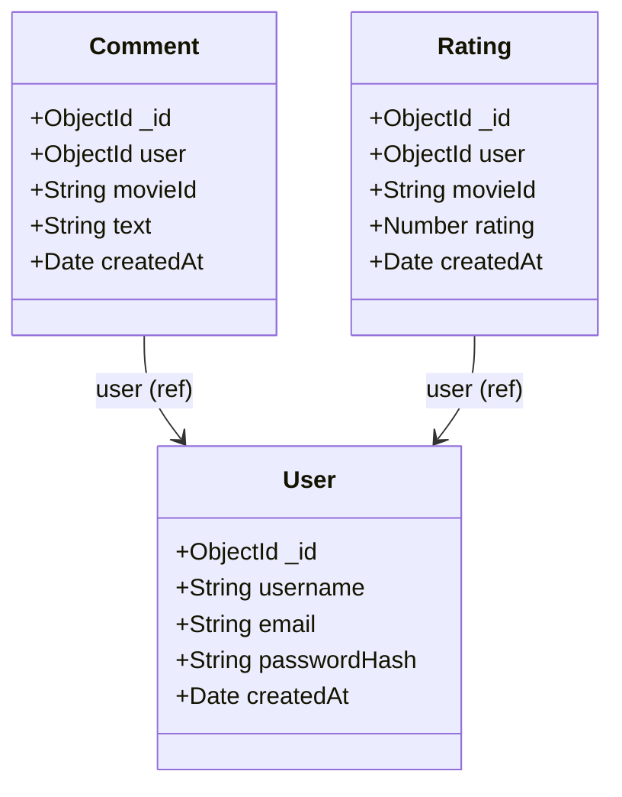
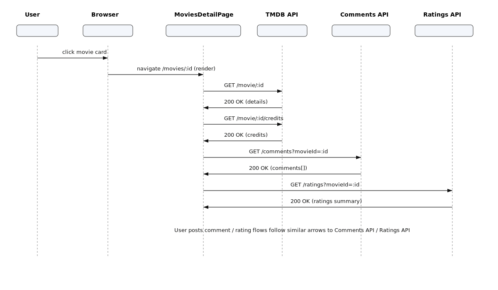
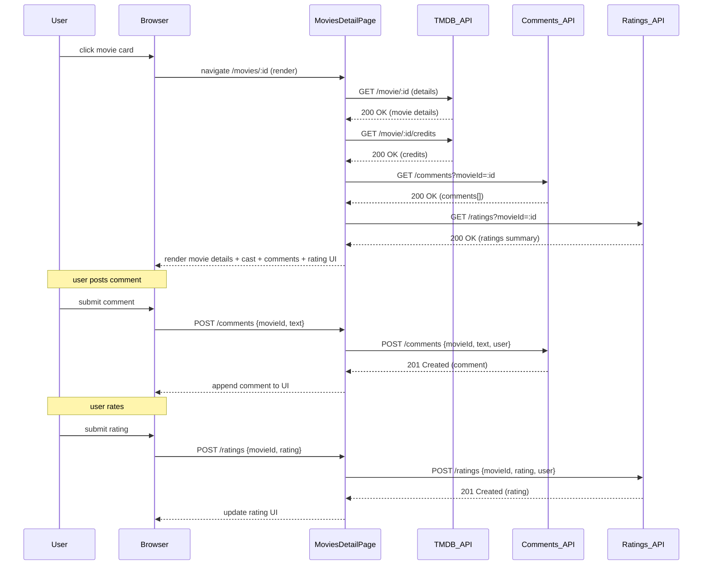

# Architecture Diagrams — docs/diagrams

This folder contains the PlantUML sources, generated SVGs, and Mermaid sources for the Film-Fiesta project architecture. The README embeds the SVG images (so you can open them directly) and also inlines Mermaid blocks (GitHub/VS Code can render these).

---

## Component Diagram



### Mermaid source

```mermaid
%% Mermaid component diagram for Film-Fiesta
flowchart LR
  subgraph Client [Client (React)]
    App[App]
    Header[Header]
    Footer[Footer]
    LoginModal[LoginModal]
    ToastStack[ToastStack]
    AppRoutes[AppRoutes]
    HomePage[Home / Popular / TopRated / MoviesList / Search / MovieDetail / PersonDetail / Recommendation / Profile]
    App --> Header
    App --> Footer
    App --> LoginModal
    App --> ToastStack
    App --> AppRoutes
    AppRoutes --> HomePage
    HomePage --> MovieCard[MovieCard]
    MoviesListPage[MoviesListPage] --> MovieCard
    MoviesDetailPage[MoviesDetailPage] --> MovieCard
    SearchPage[SearchPage] --> MovieCard
    Header --> LoginModal
    Header --> SearchPage
  end

  subgraph External [API / Server]
    TMDB[TMDB API]
    ServerAPI[Server: Auth / Comments / Ratings]
  end

  MoviesDetailPage -->|fetch details / credits / images| TMDB
  MoviesDetailPage -->|GET/POST comments| ServerAPI
  MoviesDetailPage -->|GET/POST ratings| ServerAPI
  ProfilePage --> ServerAPI

  classDef pkg fill:#fff6e6,stroke:#d9a500
  class Client pkg
  class External pkg
```

---

## Server Models (Class Diagram)



### Mermaid source



---

## Sequence: Movie Detail Flow



### Mermaid source



---

## Sources included
- PlantUML sources: `component_diagram.puml`, `server_class_diagram.puml`, `sequence_movie_detail.puml`
- Generated SVGs: `component_diagram.svg`, `server_class_diagram.svg`, `sequence_movie_detail.svg`
- Mermaid sources: `component_diagram.mmd`, `server_class_diagram.mmd`, `sequence_movie_detail.mmd`

## Notes
- GitHub renders Mermaid blocks when included in Markdown; the `.mmd` files are provided for convenience and can be opened with a Mermaid previewer in VS Code.
- If you'd like PNG versions or separate standalone Markdown pages for each diagram, I can add those as well.
